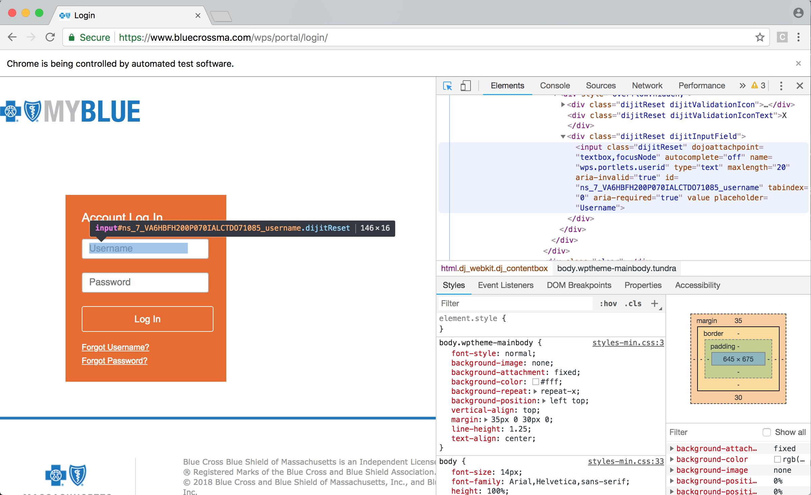
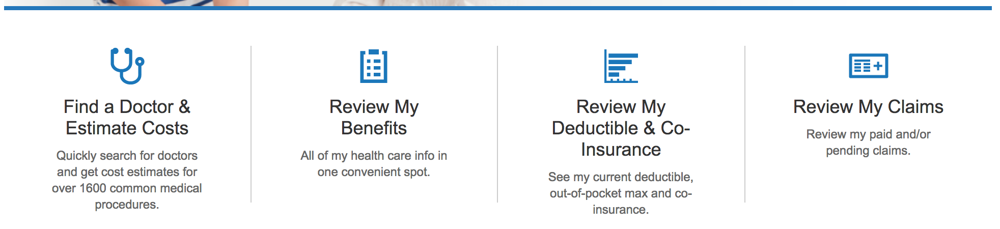
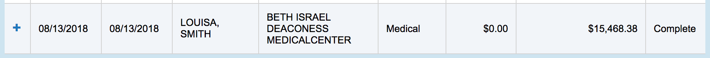
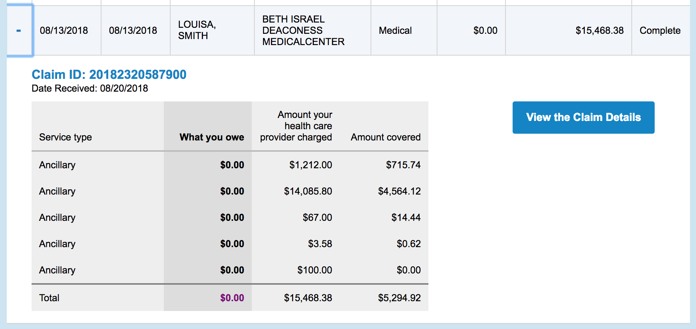

```{r setup, include=FALSE}
knitr::opts_chunk$set(echo = TRUE, message = FALSE, warning = FALSE, eval = FALSE, cache = FALSE)
load("~/Documents/website/code/data/claims.Rdata")
```

There's so much data out there, and yet I have access to so little of it. Of course, the most interesting data of all is that about me. As often as I can, I like to collect data on myself, or analyze data that others have collected on me.

One skill that I've been wanting to practice is web-scraping: gathering data from the internet. While trying to keep track of my insurance claims, I grew frustrated that my insurance company didn't have an easy-to-use system for downloading or even just viewing that data. So I figured that attempting to collect my medical claims data would be perfect practice.

While [my last post](blog/tidy-tuesday-california-fires) highlighted a very basic attempt to get some data off of Wikipedia, this challenge would be much harder because my insurance data is password protected. Also, it doesn't come in easy tabular form. First I tried and failed at using similar methodology as in my last post, in particular with the `rvest` or `httr` packages. While browsing this [StackOverflow](https://stackoverflow.com/questions/24723606/scrape-password-protected-website-in-r) question and its links, I came across a better solution than trying to submit a form to a web session and hope it was working invisibly: use the `RSelenium` package. This [tutorial](https://ropensci.org/tutorials/rselenium_tutorial/) was my most helpful resource, but I also got some hints from this [site](http://robertmyles.github.io/2016/04/27/web-navigation-in-r-with-rselenium/).

What `RSelenium` does is allow you to navigate a web browser without actually touching the browser. You can write code to enter text, extract text, click, scroll, and anything else you might need to do. Let's look at how it works.

First, the setup. Since I needed to enter my password as text into the code, I used a tool in RStudio to avoid having to save that text in my code. When I run the `askForPassword()` function, up pops a box I can type my password into, which is then stored as the `secret` object. I also needed a `list()` object to store by data, and the url for my insurance company.

```{r}
# devtools::install_github("ropensci/RSelenium")
library(RSelenium)
library(tidyverse)
secret <- rstudioapi::askForPassword() # not telling you my password!
dat <- list()
login_url <- "https://www.bluecrossma.com/wps/portal/login/"
```

This next bit of code I basically took directly off the internet. It opens a Google Chrome session (the default browser, though you can change that) behind my RStudio session and navigates to the given site. If you look at the browser, it reports that "Chrome is being controlled by automated test software." I feel like a robot! If a website asked me to verify that I am not, I'm not sure that I could!

```{r}
rD <- rsDriver()
remDr <- rD[["client"]]
remDr$navigate(login_url)
Sys.sleep(5) # make sure it loads the site before trying the next action
```

The next thing I needed to do was identify the text box on the login screen where I would enter my username and password. Right-clicking in a Chrome window and choosing "Inspect" allows you to navigate the source code behind any given page. Once you've found the code that points to the object you want, there are a few different ways to identify it. Finding that code is made easy by clicking the arrow in the upper-left corner of the inspection window, which allows you to mouse over the page and identify the corresponding code.

Here's the box for the username I'll need to fill:

{width=100%}

I could use the "id" from the code, the "css selector" that shows up when you mouse over the box (which may not be unique, as we'll see below), or the "xpath", which you can copy with a right-click. I tend to use xpaths, except when they fail. Here they worked, for both the username and the password boxes. The `findElement()` function points to whatever object you've identified, after which you can `sendKeysToElement()`. This can be either text, like my username, or a key command, like pressing "enter" (as if on my keyboard) once my password is in.

```{r}
username <- remDr$findElement(
  using = "xpath", '//*[@id="ns_7_VA6HBFH200P070IALCTDO71085_username"]'
)
username$sendKeysToElement(list("louisahsmith"))
password <- remDr$findElement(
  using = "xpath", '//*[@id="ns_7_VA6HBFH200P070IALCTDO71085_password"]'
)
password$sendKeysToElement(list(secret, key = "enter")) # enter to submit
Sys.sleep(5) # pause to let load
```

I put the `Sys.sleep()` commands in there so that the new page I'm directed to has time to load before I do my next action. It's also helpful below when I'm toggling elements on a page on and off, and just in general so as not to bombard a site with requests.

Here I'm looking for the link to review my claims. Trying to access it with its xpath wasn't consistenly working (it apparently changed every time the page was reloaded), but I could identify that each of the four options was the same type of CSS object, and I selected all of them. Then I just had to choose the one that matched the text I was looking for, and click it.

{width=100%}

```{r}
webElems <- remDr$findElements(using = "css selector", "li.large-3")
resHeaders <- unlist(lapply(webElems, function(x) {
  x$getElementText() # read the text from each of the headers
}))
webElem <- webElems[[which(
  resHeaders == "Review My Claims\nReview my paid and/or pending claims."
)]] # choose the header that corersponds to what I want
webElem$clickElement()
Sys.sleep(2)
```

The next page is where the data is. If it were better formatted, I could have just copy and pasted and saved myself all this trouble, since I'm only looking for my own claims and it's not a process I'll have to repeat over a number of people. However, the claims are spread across a number of pages, with a maximum of 20 per page, and some of the important information is hidden until you click the `+` button next to a claim.

{width=100%}

{width=100%}

First I had to select the "View year-to-date" option, instead of just the past 30 days. 

```{r}
elem2 <- remDr$findElement(using = "id", "claimPeriod")
elem2$sendKeysToElement(list("y", key = "enter")) # "y" for "Year-to-date"
updateBut <- remDr$findElement(using = "id", "filterClaimsBtn")
updateBut$clickElement()
Sys.sleep(10)
```

Then I wrote a function to open all of the windows with the `+` button on a given page. It identifies the cells in each row by CSS type, then chooses the `+` one, and then clicks it. Because it takes a second to open each window, I gave it some time to do so with some more `Sys.sleep()` calls. After opening each one, I choose the data I want from the "Total" row, as well as some data from the original row, and keep it.

```{r}
data_page <- function(remDr) {
  toggs <- remDr$findElements(using = "css selector", "td.dojoxGridCell")
  Sys.sleep(1)
  toggvals <- unlist(lapply(toggs, function(x) {
    x$getElementText()
  }))
  Sys.sleep(3)
  # this is the data I want from the original rows
  date <- toggvals[seq(2, length(toggvals), by = 9)] 
  type <- toggvals[seq(6, length(toggvals), by = 9)]
  # these are the cells I want to click to open
  goodtoggs <- toggs[which(toggvals == "+")]
  lapply(goodtoggs, function(X) {
    X$clickElement()
    Sys.sleep(2)
  })
  # this is the data I want from the last row of the interior table
  totals <- remDr$findElements(using = "css selector", "tr.total")
  total_vals <- unlist(lapply(totals, function(x) {
    x$getElementText()
  }))
  Sys.sleep(1)
  keep <- tibble(date, type, total_vals)
}
```

I happen to know that so far I have 5 pages of claims from the past year, so I repeated this 5 times, going to the next page after each set of 20 windows was opened and read. Since this will change as more claims are processed, in the future I should rewrite this code so that it will identify how many pages there are without my help.

```{r}
for (i in 1:5) {
  # open the windows and gather data
  dat[[i]] <- data_page(remDr)
  
  # go to the next page
  nextBut <- remDr$findElement(using = "id", "next")
  nextBut$clickElement()
  Sys.sleep(5)
}
claims <- reduce(dat, bind_rows)
```

Finally I put it all together.

```{r, eval = TRUE}
dplyr::glimpse(claims)
```

There's still some cleaning to do, and of course the analysis part, but I'll save that for another post!