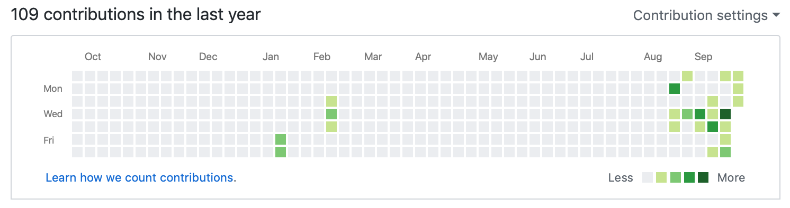
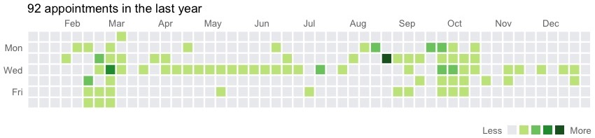

I've spent a lot of time at the doctor's office and hospital over the past year. I've been exploring different ways of visualizing this experience, and now that I have most of the rest of the year's appointments in my calendar, I decided to get them out of my calendar and into R for some fun.

The inspiration for this visualization is the heatmap on Github that shows you how often you create commits, issues, etc. I've only recently started to use Github on an everyday basis (well, you can see below that I actually started back in January before I got sick), so my heatmap isn't that impressive. (However, I did create my first issue -- on someone else's repository -- recently, which I was really proud of!)

{width=100%}

My goal was to recreate that style of heatmap calendar as closely as possible, with the colors representing how many appointments I had in a single day. I keep my medical appointments in their own calendar, so it was easy to download the `.ics` file from Google Calendar or export it from iCal. Then I used [this online tool](http://www.indigoblue.eu/ics2csv/) to convert the file into a `.csv` file.
One problem I did run into was how repeating events were recorded. I have radiation every day for 3.5 weeks, mostly at the same time, so I had just created a repeating event for those appointments. However, this only showed up in the `.csv` file as one unique event, so I had to manually edit that and a couple of other things. Luckily it wasn't a huge problem.

To start off, once I read the file into R I used some code for a similar heatmap I remembered seeing on [this blog post](https://www.garrickadenbuie.com/blog/2018/08/24/greatest-twitter-scheme/). I grouped the appointments by day, counted the number per day, and organized them into weeks. That was straightforward enough. Then I had to do a lot of editing of the `ggplot()` theme to get the heatmap the way I wanted.

I didn't attempt to measure every aspect of the Githup heatmap, but I did look into the source code of the website to find the exact colors used. Luckily the most appointments I had in a day was four, which matched the four colors of green used on Github. The hardest thing was moving the legend to the appropriate place and then adding the "Less" and "More" labels next to it. I experimented with some different methods, including trying to add a bunch of white levels to the legend to shift it over, but finally I settled on one that I was moderately happy with. I've added individual `annotate` elements to a figure several times before, but this was my first time working outside of the plotting window, which was only a little bit exciting -- mostly just annoying.

Here's the finished product:

{width=100%}

Originally I didn't start off with the title, as I didn't plan on recreating the box and links around the heatmap, but I decided to add it anyway. Since there's no link to tell you how I counted appointments, I'll just say that I counted anything that required me to go to a different office -- two "appointments" within the same clinic, one after the other, don't count. Or else I'd have a lot more dark green!

Here's the code. Like I said earlier, the backbone was source code I found [here](https://www.garrickadenbuie.com/blog/2018/08/24/greatest-twitter-scheme/). I also needed some serious Stack Overflow help for the text annotations!

```{r, eval = FALSE}
library(tidyverse)
library(lubridate)
cal <- read_csv(here::here("code", "appointments.csv"))
by_day <- cal %>%
  mutate(
    date_time = paste(`DTSTART-DATE`, `START-TIME`),
    date_time = mdy_hm(date_time),
    # get the date of the sunday prior to each appointment
    created_day = floor_date(date_time, "day"),
    wday = wday(date_time)
  ) %>%
  select(created_day, wday) %>%
  na.omit() %>% # (I had a blank line in the csv file)
  mutate(
    wday = factor(wday, levels = 1:7, labels = c(
      "Sun", "Mon", "Tues", "Wed", "Thurs", "Fri", "Sat"
    )),
    # assign weeks and months for counting and labeling purposes
    week = floor_date(created_day, "week"),
    week = as_date(week),
    month = floor_date(created_day, "month"),
    month = as_date(month)
  ) %>%
  group_by(week, wday, month) %>%
  # month is unnecessary to group by 
  # but it's a good trick to keep that variable!
  count() %>%
  mutate(
    n = factor(as.character(n), levels = c("1", "2", "3", "4")),
    # add a 0 level to the 1:4 counts and move it to the front
    n = fct_expand(n, "0"),
    n = fct_relevel(n, "0")
  )
# match the format of the axis labels
months <- seq(min(by_day$month), max(by_day$month), by = "month")
month_labels <- strftime(months, "%b")
# create the text annotations
less <- grid::textGrob("Less", gp = grid::gpar(fontsize = 10, col = "#767676"))
more <- grid::textGrob("More", gp = grid::gpar(fontsize = 10, col = "#767676"))
p <- ggplot(by_day) +
  aes(week, fct_rev(wday), fill = n) +
  geom_tile(width = 7, height = 1) +
  # decided to make the "spaces" lines 
  # instead of actual spaces between grey tiles
  geom_hline(yintercept = seq(.5, 7.5, 1), col = "white", size = .85) +
  geom_vline(
    xintercept = seq(
      as_date("2018-01-01"), as_date("2018-12-31"), by = "week"
    ) + 2.5,
    col = "white", size = .85
  ) +
  # the expand = F argument tells it to use those exact limits, no extra
  coord_fixed(
    ratio = 7, 
    xlim = c(min(by_day$month) + 2.5, max(by_day$month) + 25), 
    expand = FALSE
    ) +
  labs(x = NULL, y = NULL) +
  scale_x_date(
    expand = c(0, 0), breaks = months, labels = month_labels, position = "top"
    ) +
  scale_y_discrete(labels = c("", "Fri", "", "Wed", "", "Mon", "")) +
  scale_fill_manual(
    limits = levels(by_day$n),
    values = c("#EBEDF0", "#C6E48B", "#7BC96F", "#239A3B", "#196127"),
    name = NULL
  ) +
  theme(
    # ugh so much trial and error to get these numbers:
    legend.position = c(.904, -.405),
    legend.justification = "bottom",
    panel.grid = element_blank(),
    panel.background = element_rect(fill = "#EBEDF0"),
    axis.ticks.y = element_blank(),
    axis.ticks.x = element_blank(),
    axis.text.x = element_text(hjust = 0.5, color = "#767676", size = 10),
    axis.text.y = element_text(color = "#767676", size = 10),
    plot.margin = margin(4, 5, 4, 4),
    legend.key.size = unit(10, "pt"),
    legend.text = element_blank(),
    legend.spacing.x = unit(.05, "cm"),
    plot.title = element_text(hjust = 0, vjust = 0)
  ) +
  ggtitle(paste0(nrow(cal) - 1, " appointments in the last year")) +
  guides(fill = guide_legend(nrow = 1)) +
  annotation_custom(less,
    xmin = as_date("2018-10-25"),
    xmax = as_date("2018-10-25"), ymin = -2, ymax = -1
  ) +
  annotation_custom(more,
    xmin = as_date("2018-12-20"),
    xmax = as_date("2018-12-20"), ymin = -2, ymax = -1
  )
# this is necessary to get the annotations outside the plotting area to print
gt <- ggplot_gtable(ggplot_build(p))
gt$layout$clip[gt$layout$name == "panel"] <- "off"
grid::grid.draw(gt)
```
