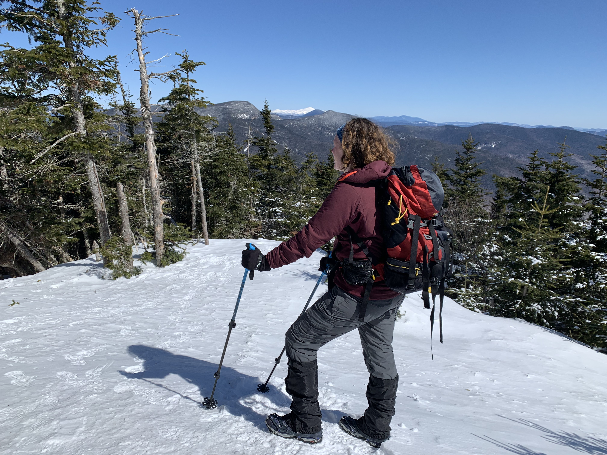
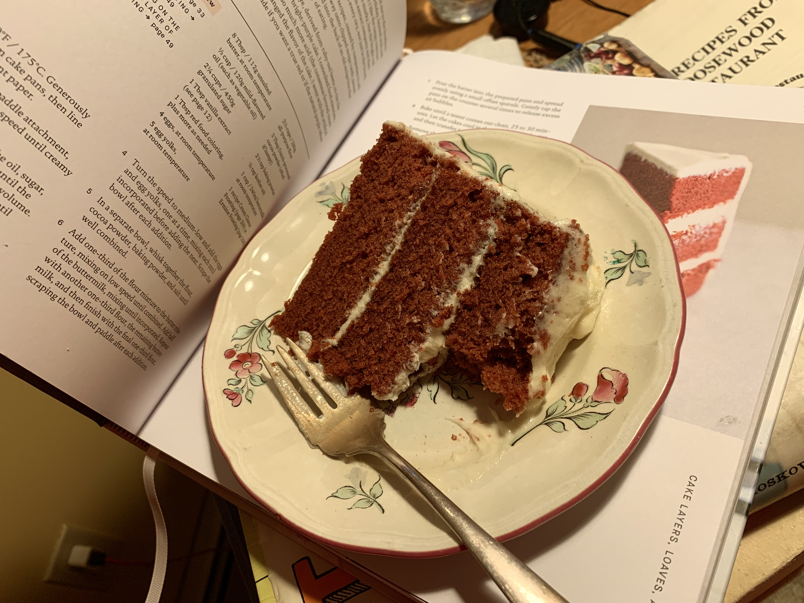

```{r, include = FALSE}
knitr::opts_chunk$set(echo = FALSE)
```
```{css}
.figure {
  float: right;
  padding: 10px;
  max-width:40%;
}
```

::: {.floating}
```{r fig.cap = "Summit of Mt. Tecumseh"}

```
I am an assistant professor in the Department of Health Sciences at Northeastern University's [Bouvé College of Health Sciences](https://bouve.northeastern.edu) and at the [Roux Institute](https://roux.northeastern.edu) in my hometown of Portland, ME. Previously I trained in the [Program in Population Health Sciences](https://www.hsph.harvard.edu/phdphs/) and the [Department of Epidemiology](https://www.hsph.harvard.edu/epidemiology/) at the Harvard T.H. Chan School of Public Health. 
I also have a Master of Science degree from the [Department of Biostatistics](https://www.hsph.harvard.edu/biostatistics/). 
My research interests are in epidemiologic and biostatistical methods as well as reproductive and child health. I first developed these interests at [U.C. Berkeley](http://sph.berkeley.edu), where I earned my M.S. in epidemiology, and while teaching third grade at [Little Wound School](http://littlewound.us) in Kyle, SD, where I lived for three years. Prior to that I studied [comparative literature](https://www.brown.edu/academics/comparative-literature/) (focusing on literary translation from French and Portuguese) and [community health](https://www.brown.edu/academics/public-health/education-training/undergraduate/) at Brown University.

```{r fig.cap = "Red velvet cake"}

```
My passion for teaching has continued beyond my experience in elementary education. I enjoy introducing students to epidemiology and biostatistics as well as delving into more advanced topics in causal inference. 
I love to create teaching materials, some of which can be found on [this site](teaching.html).

I also love hiking and camping, baking, reading novels, and programming in R. 
I'm working my way through the [New Hampshire 4000 footers](http://www.amc4000footer.org) and through [Zoë Bakes Cakes](https://zoebakes.com/zoe-bakes-cakes/).

:::

```{js}
var myCaptions = document.getElementsByClassName("caption");

for (var i = 0; i < myCaptions.length; i++) {
  myCaptions[i].innerHTML = myCaptions[i].innerHTML.slice(11);
}
```