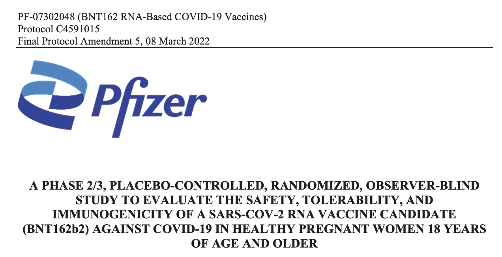
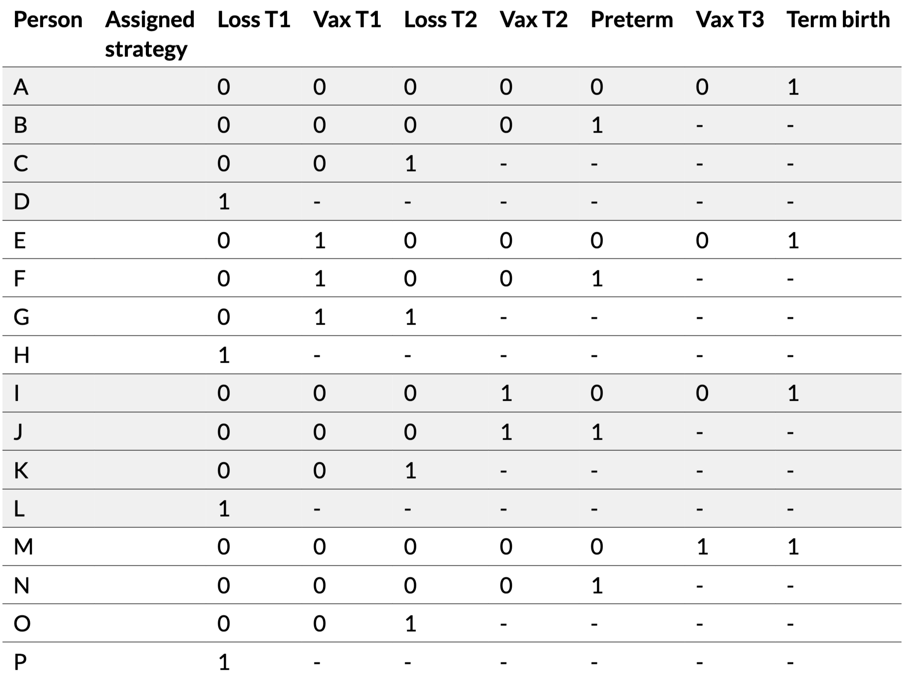

# Introduction

[pdf](slides.pdf)


```{css}
.cell-output pre {
  margin-left: 0 !important;
  padding-left: 0.5em !important;
}

.cell-output pre code {
  font-size: 0.85em;
}
```

```{r}
#| include: false
library(tidyverse)
library(ggdag)
library(dagitty)
library(knitr)
library(kableExtra)
```


## Today's goals

-   Understand the target trial framework and why it's useful in reproductive and perinatal research
-   Explore different types of pregnancy research questions that may be addressed with this approach
-   Discover some intuition behind the clone-censor-weighting approach through a numeric example

## Why pregnancy research is challenging

-   Complex timing issues (exposure, outcomes, competing events)
-   Immortal time bias is pervasive
-   Multiple individuals (pregnant person, fetus, child)
-   Need for clarity about *what* we're estimating

. . .

::: callout-tip
## One solution

The **target trial framework** forces us to be explicit about who, what, when, and how (I guess where too, but not usually as much of a problem!)
:::

## One problem: time zero

Many observational studies don't have a clear "time zero" when treatment assignment occurs

. . .

**Example**: Comparing pregnancy outcomes in:

-   People who took antidepressants during pregnancy
-   People who didn't take antidepressants during pregnancy

. . .

When are they "assigned" to exposure groups?

## Immortal time bias

If we define groups based on *what actually happened* during pregnancy:

-   "Exposed" group = those who took medication at some point
-   "Unexposed" group = those who never took medication

The exposed group had to *survive long enough* (e.g. remain pregnant) to take the medication!

-   This is a problem whenever the outcome depends on time (i.e., not just survival)

## What is a target trial?

<br>

A **hypothetical randomized trial** that would answer your causal question if it could be conducted

<br>

::: callout-note
The target trial is a *design* concept, not an analysis method. It has guided study design in epidemiology for decades but recently popularized as an explicit framework [@hernan2016using].
:::

## Why a trial?

Randomized trials have clear advantages for causal inference:

-   Randomization at baseline
    -   Not the case in observational data no matter what we do, but we can try with good confounder measurement and reasonable eligibility criteria

. . .

-   Stringent eligibility criteria
    -   Everyone who enters the study has equipoise for the treatment strategies being compared

## Why a trial?

Randomized trials have clear advantages for causal inference:

-   Clear time zero
    -   Everyone is assigned to treatment and starts follow-up at the same time
    -   We *can* make this happen in observational data with careful design

. . .

-   Well-defined treatment strategies
    -   In order to give participants their assigned treatment, people have to have rules to follow!
    -   We can define these rules in observational data too

## Why a *target* trial?

We know we can't run the randomized trial we want to conduct to answer our causal question (lack of resources, unethical to randomize, impossible to provide certain treatments/exposures, too many years of follow-up needed, too many treatment strategies to compare, etc.)

-   But we can design it hypothetically
-   And then try to emulate it as closely as possible with observational data

## Emulating a target trial

<br>

The observational study should be designed so as to match up with this trial as closely as possible

<br>

::: callout-warning
Don't jump straight to emulation without carefully thinking through the trial, though it can be helpful to think ahead. Compromises in emulation should be explicit and justified.
:::

## Essential components {.smaller}

1.  Eligibility criteria
2.  Treatment strategies
3.  Assignment procedures
4.  Follow-up period
5.  Outcome(s)
6.  Causal contrast(s)
7.  Statistical analysis plan

::: callout-note
Recently published guidelines for reporting target trial emulations detail these components: @cashin2025transparent
:::

## Eligibility criteria: the "who"

Besides making for a clearer question with more practical implications, eligibility criteria can help address confounding in the emulation by ensuring everyone included has a reasonable chance of getting the treatment strategies being compared\*

. . .

-   We might exclude people with contraindications to treatment, or those who would never consider it
-   This often means defining pregnancy status and gestational age at time zero carefully

. . .

::: aside
\*Always need *positivity*: everyone included must have some non-zero probability of receiving each treatment strategy being compared
:::

## Time zero: the "when"

The eligibility criteria also define *when* people enter the study

-   Time zero occurs when people meet eligibility criteria (and in a trial, agree to be randomized)
-   We could imagine scenarios where people meet eligibility repeatedly over time (e.g., at every antenatal care visit)
    -   We can take this into account when emulating

## Treatment strategies: the "what" and "how"

Each strategy represents an intervention we could imagine putting in motion **at time zero** for a given treatment arm:

-   Immediately upon randomization, tell everyone to get treatment (e.g., a vaccination)
-   At 6 weeks gestation (time zero), tell everyone to start treatment at 12 weeks gestation but not before
-   Tell everyone to wait until 20 weeks to start treatment
-   Tell everyone to start treatment when symptoms appear

## This is easier for some causal questions than others

-   Pharmaceutical interventions with fixed timing (e.g., vaccination at week 32 vs. no vaccination)
-   Procedure at some known clinical event (e.g., cerclage at diagnosis of short cervix vs. no cerclage)
-   Comparisons of two treatments with the same indication

::: callout-tip
It's helpful to read through existing randomized trials on similar questions to see how they defined these components, see [clinicaltrials.gov](clinicaltrials.gov) for ideas!
:::

##



##  {.smaller .scrollable}

#### Pharmaceutical example (@zidan2025bnt162b2)

+-----------------------+----------------------------------------------------------------------------------------------------------------------------------------------------------------------+
| **Components**        | **Target trial**                                                                                                                                                     |
+:======================+:=====================================================================================================================================================================+
| Causal question       | What is the effect of SARS-CoV-2 mRNA vaccine BNT162b2 on COVID-19?                                                                                                  |
+-----------------------+----------------------------------------------------------------------------------------------------------------------------------------------------------------------+
| Eligibility criteria  | Inclusion criteria:                                                                                                                                                  |
|                       |                                                                                                                                                                      |
|                       | 1.  Healthy women ≥18 years of age who are between 24 0/7 and 34 0/7 weeks' gestation on the day of planned vaccination, with an uncomplicated, singleton pregnancy. |
|                       | 2.  Healthy participants determined by medical history, physical examination, and clinical judgment to be appropriate for inclusion in the study.                    |
|                       | 3.  Documented negative HIV antibody test.                                                                                                                           |
|                       |                                                                                                                                                                      |
|                       | Exclusion criteria:                                                                                                                                                  |
|                       |                                                                                                                                                                      |
|                       | 1.  Other medical or psychiatric condition including recent (within the past year) or active suicidal ideation/behavior.                                             |
|                       | 2.  Previous clinical or microbiological diagnosis of COVID-19.                                                                                                      |
|                       | 3.  Participants with known or suspected immunodeficiency.                                                                                                           |
|                       | 4.  Bleeding diathesis or condition associated with prolonged bleeding.                                                                                              |
|                       | 5.  Previous vaccination with any COVID-19 vaccine.                                                                                                                  |
|                       | 6.  Current alcohol abuse or illicit drug use.                                                                                                                       |
|                       | 7.  Participants who receive treatment with immunosuppressive therapy.                                                                                               |
+-----------------------+----------------------------------------------------------------------------------------------------------------------------------------------------------------------+
| Treatment strategies  | 1\. Two vaccination doses                                                                                                                                            |
|                       |                                                                                                                                                                      |
|                       | 2\. No SARS-CoV-2 vaccination until the end of pregnancy                                                                                                             |
+-----------------------+----------------------------------------------------------------------------------------------------------------------------------------------------------------------+
| Assignment procedures | 1:1 randomization into the two treatment arms, stratified by gestational week                                                                                        |
+-----------------------+----------------------------------------------------------------------------------------------------------------------------------------------------------------------+
| Follow-up             | Since administering the first dose and up to 1 month post delivery                                                                                                   |
+-----------------------+----------------------------------------------------------------------------------------------------------------------------------------------------------------------+
| Outcome               | SARS-CoV-2 infection as determined by positive PCR test or clinical COVID-19 diagnosis                                                                               |
+-----------------------+----------------------------------------------------------------------------------------------------------------------------------------------------------------------+
| Causal contrast       | Incidence rate ratios; intention-to-treat (one vaccine dose) and per-protocol (two doses)                                                                            |
+-----------------------+----------------------------------------------------------------------------------------------------------------------------------------------------------------------+

## Other types of questions

It may feel weird to design a target trial for other types of causal questions

-   Unethical/impossible to randomize
    -   e.g., harmful exposures, social determinants of health

It's worth thinking through anyway to make sure you are clear about your causal question of interest (you don't have to publish it as a "target trial"!)

##  {.smaller .scrollable}

#### Non-pharmaceutical example (@smith2022timing)

+-----------------------+----------------------------------------------------------------------------------------------------------------------------------------------------------+---------+
| **Components**        | **Target trial**                                                                                                                                         |         |
+-----------------------+----------------------------------------------------------------------------------------------------------------------------------------------------------+---------+
| Causal question       | What is the effect of COVID-19 infection on preterm delivery?                                                                                            |         |
+-----------------------+----------------------------------------------------------------------------------------------------------------------------------------------------------+---------+
| Eligibility criteria  | 1\. Pregnant individuals with gestational age 12-36 weeks.                                                                                               |         |
|                       |                                                                                                                                                          |         |
|                       | 2\. No known previous SARS-CoV-2 infection                                                                                                               |         |
|                       |                                                                                                                                                          |         |
|                       | 3\. No previous vaccination for COVID-19                                                                                                                 |         |
+-----------------------+----------------------------------------------------------------------------------------------------------------------------------------------------------+---------+
| Treatment strategies  | 1\. Symptomatic COVID-19 within a week after enrollment.                                                                                                 |         |
|                       |                                                                                                                                                          |         |
|                       | 2\. No SARS-CoV-2 infection for the rest of the pregnancy.                                                                                               |         |
+-----------------------+----------------------------------------------------------------------------------------------------------------------------------------------------------+---------+
| Assignment procedures | Randomization at enrollment, stratified by gestational age (in weeks).                                                                                   |         |
+-----------------------+----------------------------------------------------------------------------------------------------------------------------------------------------------+---------+
| Follow-up             | Patients are followed from the time of COVID-19 testing or enrollment (time zero) until delivery, loss to follow-up, or administrative end of follow-up. |         |
+-----------------------+----------------------------------------------------------------------------------------------------------------------------------------------------------+---------+
| Outcome               | Preterm delivery, defined as delivery before 37 completed weeks of gestation.                                                                            |         |
+-----------------------+----------------------------------------------------------------------------------------------------------------------------------------------------------+---------+
| Causal contrast       | Intention-to-treat effect on the risk ratio and risk difference scales for each gestational week (time zero)                                             |         |
+-----------------------+----------------------------------------------------------------------------------------------------------------------------------------------------------+---------+

##  {.smaller .scrollable}

#### Notes on these components and things to think about in emulation (hopefully not compromises to the integrity of the target trial)

+-----------------------+------------------------------------------------------------------------------------------------------------------------------+----------+
| **Components**        | **Target trial**                                                                                                             |          |
+-----------------------+------------------------------------------------------------------------------------------------------------------------------+----------+
| Eligibility criteria  | -   Based only on **pre-baseline** characteristics                                                                           |          |
|                       | -   Generally requires pre-baseline observation window                                                                       |          |
+-----------------------+------------------------------------------------------------------------------------------------------------------------------+----------+
| Treatment strategies  | -   Won't be able to emulate actual placebo or blinding (can assign no treatment if realistic)                               |          |
|                       | -   Some people must have "adhered" to the treatment strategy                                                                |          |
+-----------------------+------------------------------------------------------------------------------------------------------------------------------+----------+
| Assignment procedures | -   Randomization (within levels of confounders) is always an assumption                                                     |          |
|                       | -   Assignment "happens" as soon as someone meets eligibility criteria                                                       |          |
+-----------------------+------------------------------------------------------------------------------------------------------------------------------+----------+
| Follow-up             | -   Monitoring for the outcome throughout follow-up (e.g., SARS-CoV-2 testing) may need to be part of the treatment strategy |          |
+-----------------------+------------------------------------------------------------------------------------------------------------------------------+----------+
| Outcome               | -   Outcome ascertainment can't be blinded in emulation                                                                      |          |
+-----------------------+------------------------------------------------------------------------------------------------------------------------------+----------+
| Causal contrast       | -   Intention-to-treat effect makes sense when "most" of the treatment happens immediately upon randomization                |          |
|                       | -   Per-protocol useful when you don't know right away who starts what treatment                                             |          |
+-----------------------+------------------------------------------------------------------------------------------------------------------------------+----------+

## Examples

@avalos2023maternal

@caniglia2018emulating

@chiu2024metformin

@wong2024nirmatrelvir

## Discussion

1.  What was the causal question?
2.  What were the key components of the target trial protocol, including eligibility criteria, treatment strategies, etc. What was time zero?
3.  What made this question challenging to design an "emulatable" target trial?
4.  How did the authors handle the challenge? Were there compromises made?

## @avalos2023maternal - Treating hypertension at different thresholds

**Key features/challenges:**

-   Treatment strategies are **dynamic** - depend on clinical measurements, don't know ahead of time who will need treatment when
-   People can be part of multiple treatment groups over time

## @caniglia2018emulating - Antiretroviral therapy started before conception

**Key features/challenges:**

-   Treatment/time zero occurs **before pregnancy**
-   Competing event: not getting pregnant
-   Can't condition on pregnancy without bias
-   Treatment strategy includes getting pregnant within a certain time frame

## @chiu2024metformin - Metformin in first trimester

**Key features/challenges:**

-   Treatment happens early in pregnancy
-   Competing risks: pregnancy loss – can't observe malformations without live birth
-   Use of composite outcome

## @wong2024nirmatrelvir - COVID-19 antiviral within 5 days of infection

**Key features/challenges:**

-   Treatment must start within a short window after infection (grace period)
-   Rare exposure, rare outcomes

## Common themes across papers {.smaller}

1.  Time zero must be clearly defined
    -   Before hypertension (Avalos)
    -   Preconception (Caniglia)
    -   Early pregnancy (Chiu)
    -   At sympomatic infection (Wong)

. . .

2.  Strategies must be realistic and well-defined
    -   Not just "exposed vs. unexposed"
    -   Include rules for what happens over time, e.g., grace period, blood pressure monitoring

. . .

3.  Competing events are common in pregnancy
    -   Not conceiving competes with pregnancy outcomes
    -   Pregnancy loss competes with later outcomes

## Thoughts/questions

# Emulating target trials with clone-censor weighting

This example is somewhat based on an example about comparing duration of treatment in @hernan2018how

## Does vaccination timing in pregnancy affect live birth?

**Eligibility**: Unvaccinated, at/soon after conception

**Treatment strategies:**

-   Strategy 0: Never vaccinate during pregnancy
-   Strategy 1: Vaccinate in trimester 1 only
-   Strategy 2: Vaccinate in trimester 2 only
-   Strategy 3: Vaccinate in trimester 3 only

**Outcome:** Live birth (yes/no)

## Pregnancy timeline

```{r}
#| fig-width: 10
#| fig-height: 4
library(ggplot2)

# Create timeline data
timeline <- data.frame(
  x = c(0, 13, 27, 37, 40),
  label = c("Conception\nand Randomization", "End T1", "End T2", "End T3", "Term")
)

# Vaccination points (near end of each trimester)
vax_points <- data.frame(
  x = c(12, 26, 36),
  y = 1.3,
  label = c("Vax T1", "Vax 2", "Vax T3")
)

# Loss/outcome points (midway through trimesters)
outcome_points <- data.frame(
  x = c(7, 20, 32),
  y = 0.7,
  label = c("Pregnancy\nLoss", "Pregnancy\nLoss", "Preterm\nDelivery")
)

ggplot() +
  # Main timeline
  geom_segment(aes(x = 0, xend = 40, y = 1, yend = 1),
               arrow = arrow(length = unit(0.3, "cm")), linewidth = 1) +
  # Trimester divisions
  geom_segment(data = timeline[2:4,],
               aes(x = x, xend = x, y = 0.9, yend = 1.1),
               linewidth = 0.5, linetype = "dashed") +
  # Timeline labels
  geom_text(data = timeline, aes(x = x, y = 0.85, label = label),
            size = 4, vjust = 1) +
  # Vaccination arrows (pointing down from above)
  geom_segment(data = vax_points,
               aes(x = x, xend = x, y = y, yend = 1.05),
               arrow = arrow(length = unit(0.2, "cm")),
               color = "blue", linewidth = 0.8) +
  geom_text(data = vax_points, aes(x = x, y = y + 0.05, label = label),
            color = "blue", size = 4, vjust = 0) +
  # Outcome arrows (pointing up from below)
  geom_segment(data = outcome_points,
               aes(x = x, xend = x, y = y, yend = 0.95),
               arrow = arrow(length = unit(0.2, "cm")),
               color = "red", linewidth = 0.8) +
  geom_text(data = outcome_points, aes(x = x, y = y - 0.05, label = label),
            color = "red", size = 4, vjust = 1) +
  # Trimester labels
  annotate("text", x = 6.5, y = 1.15, label = "Trimester 1",
           fontface = "italic", size = 3.5) +
  annotate("text", x = 20, y = 1.15, label = "Trimester 2",
           fontface = "italic", size = 3.5) +
  annotate("text", x = 32, y = 1.15, label = "Trimester 3",
           fontface = "italic", size = 3.5) +
  scale_x_continuous(limits = c(-2, 42), breaks = NULL) +
  scale_y_continuous(limits = c(0.5, 1.6)) +
  theme_void() +
  theme(plot.margin = margin(10, 10, 10, 10))
```

::: callout-note
We are simplifying things by assuming vaccination happens at the end of a trimester, after any pregnancy losses
:::

## Randomized trial data {.smaller .scrollable}

16 pregnant people randomly assigned to 4 strategies:

```{r}
trial_data <- data.frame(
  person = LETTERS[1:16],
  assigned = c(0, 0, 0, 0,  # Strategy 0: never vax
               1, 1, 1, 1,  # Strategy 1: vax T1
               2, 2, 2, 2,  # Strategy 2: vax T2
               3, 3, 3, 3), # Strategy 3: vax T3
  loss_t1 = c(0, 0, 0, 1,  # Strategy 0
              0, 0, 0, 1,  # Strategy 1
              0, 0, 0, 1,  # Strategy 2
              0, 0, 0, 1), # Strategy 3
  vax_t1 = c(0, 0, 0, NA,
             1, 1, 1, NA,
             0, 0, 0, NA,
             0, 0, 0, NA),
  loss_t2 = c(0, 0, 1, NA,
              0, 0, 1, NA,
              0, 0, 1, NA,
              0, 0, 1, NA),
  vax_t2 = c(0, 0, NA, NA,
             0, 0, NA, NA,
             1, 1, NA, NA,
             0, 0, NA, NA),
  preterm = c(0, 1, NA, NA,
              0, 1, NA, NA,
              0, 1, NA, NA,
              0, 1, NA, NA),
  vax_t3 = c(0, NA, NA, NA,
             0, NA, NA, NA,
             0, NA, NA, NA,
             1, NA, NA, NA),
  term = c(1, NA, NA, NA,
                1, NA, NA, NA,
                1, NA, NA, NA,
                1, NA, NA, NA)
) |>
    mutate(livebirth = ifelse(preterm == 1 | term == 1, 1, 0),
           livebirth = replace_na(livebirth, 0))

trial_data |>
    mutate(across(everything(), \(x) replace_na(as.character(x), "-"))) |>
  kable(col.names = c("Person", "Assigned strategy", "Loss T1", "Vax T1", "Loss T2",
                      "Vax T2", "Preterm", "Vax T3", "Term birth", "Live birth")) |>
  row_spec(1:4, background = "#f0f0f0") |>
  row_spec(9:12, background = "#f0f0f0")
```

## Randomized trial results

By **assigned** strategy:

```{r}
trial_results <- trial_data |>
  group_by(assigned) |>
  summarise(
    n = n(),
    livebirths = sum(livebirth == 1),
    prob = round(livebirths / n, 2),
    .groups = "drop"
  )

trial_results |>
  kable(col.names = c("Assigned strategy", "N", "Live births", "Probability"))
```

All strategies have 50% live birth rate (we are operating in a situation where the **null hypothesis** of no effect of vaccination at any time is true)

## Moving to observational data

In observational data, we don't see the assigned strategy.

We only see what actually happened:

-   When (if) people got vaccinated
-   When pregnancy losses occurred
-   Whether there was a live birth and when

Let's classify people by **observed** vaccination status and timing...

## Observed data {.smaller .scrollable}

Same 16 people, but now we don't know their assigned strategy:

```{r}
obs_data <- trial_data |>
  select(-assigned)

# Determine observed strategy for each person
obs_classified <- obs_data |>
  mutate(
    obs_strategy = case_when(
      vax_t1 == 1 ~ "1 (Vax T1)",
      vax_t2 == 1 ~ "2 (Vax T2)",
      vax_t3 == 1 ~ "3 (Vax T3)",
      TRUE ~ "0 (Never)"
    )
  ) |>
    relocate(obs_strategy, .before = loss_t1)

obs_classified |>
  mutate(across(everything(), \(x) replace_na(as.character(x), "-"))) |>
  kable(col.names = c("Person", "Observed treatment", "Loss T1", "Vax T1", "Loss T2",
                      "Vax T2", "Preterm", "Vax T3", "Term birth", "Live birth")) |>
  row_spec(1:4, background = "#f0f0f0") |>
  row_spec(9:12, background = "#f0f0f0")
```

## Naive analysis: by achieved vaccination

Classify by when they actually got vaccinated:

```{r}
obs_results <- obs_classified |>
  group_by(obs_strategy) |>
  summarise(
    n = n(),
    livebirths = sum(livebirth == 1),
    prob = round(livebirths / n, 2),
    .groups = "drop"
  )

obs_results |>
  kable(col.names = c("Observed vaccination", "N", "Live births", "Probability"))
```

## The problem: immortal time bias!

Later vaccination appears highly protective!

**But:** People who got vaccinated later had to **survive** to that point

-   All of the pregnancy losses get assigned to the "Never" or "Vax T1" groups
-   By the time people are classified as "Vax T2" or "Vax T3", they have already survived those earlier periods

## Think like a randomized trial

In a randomized trial, people are assigned to strategies at time zero -- even if they don't get treatment (by choice, not surviving long enough, etc.), they are analyzed in their assigned group\*

::: aside
\*In an intention-to-treat analysis. Even under randomized assignment, an "as-treated" analysis would have the same problem if people are classified by what they actually did
:::

## Immortal time bias {.smaller}

Generally the not-treated group will underestimate the true risk, and the treated group will overestimate it (the later treated, or longer duration required, the more the bias):

```{r}
comparison <- data.frame(
  Strategy = c("0 (Never)", "1 (Vax T1)", "2 (Vax T2)", "3 (Vax T3)"),
  True_Effect = c("0.50", "0.50", "0.50", "0.50"),
  Naive_Estimate = c("0.30", "0.67", "1.00", "1.00"),
  Bias = c("↓", "↑", "↑↑", "↑↑")
)

comparison |>
  kable(col.names = c("Strategy", "True probability", "Naive estimate", "Bias"))
```

This makes treatment appear to reduce risk when there is actually no effect (or if there were a true effect of treatment, this might mask it)

## Emulation via clone-censor-weighting

Pretend you have a randomized trial in which everyone is assigned to all strategies at time zero:

1.  **Clone** everyone to all compatible strategies
2.  **Censor** clones when they deviate from assigned strategy
3.  **Weight** to correct for selection bias from censoring

## Step 1: Cloning {.smaller .scrollable}

For each person, create clones for all treatment strategies

```{r}
trial_data |>
    mutate(assigned = 0,
           person = paste0(person, "-0"),
           across(everything(), as.character),
           across(everything(), \(x) replace_na(x, "-"))) |>
    kable(col.names = c("Person", "Assigned strategy", "Loss T1", "Vax T1", "Loss T2",
                        "Vax T2", "Preterm", "Vax T3", "Term birth", "Live birth")) |>
    row_spec(1:4, background = "#f0f0f0") |>
    row_spec(9:12, background = "#f0f0f0")
```

## Treatment strategy Vax T1 {.smaller .scrollable}

```{r}
trial_data |>
    mutate(assigned = 1,
           person = paste0(person, "-1"),
           across(everything(), as.character),
           across(everything(), \(x) replace_na(x, "-"))) |>
    kable(col.names = c("Person", "Assigned strategy", "Loss T1", "Vax T1", "Loss T2",
                        "Vax T2", "Preterm", "Vax T3", "Term birth", "Live birth")) |>
    row_spec(1:4, background = "#f0f0f0") |>
    row_spec(9:12, background = "#f0f0f0")
```

## And so on...

## Step 2: Censoring {.smaller}

Censor clones when their observed data becomes incompatible with assigned strategy:

-   Strategy 0 (never): censor if vaccinated in T1, T2, or T3
-   Strategy 1 (vax T1): censor if *not* vaccinated in T1
-   Strategy 2 (vax T2): censor if vaccinated in T1 or *not* vaccinated in T2
-   Strategy 3 (vax T3): censor if vaccinated in T1 or T2 or *not* vaccinated in T3

If there is a pregnancy loss in T1, do not censor afterward--we don't know whether they would have gotten vaccinated or not (can contribute to multiple strategies)

## Censoring

-   This is why defining the treatment strategies precisely is incredibly important, more so than in a real trial
    -   In real life, "clinical judgment" may result in someone stopping treatment
    -   In your emulation, should you censor someone if they stop treatment? Or would they be "allowed" to stop in a real trial?
-   If everyone ends up censored, you're trying to study a treatment strategy for which you have no positivity!
    -   Come up with a new strategy that allows more flexibility!

## Practice censoring {.smaller}

::::: columns
::: {.column width="80%"}

:::

::: {.column width="20%"}
[Picture](images/clipboard-2971386099.png)

[Data](ccw-example-data.csv)
:::
:::::

## Step 3: Weighting

Selection bias introduced by censoring must be corrected

Use **inverse probability weighting**:

-   Weight = 1 / (probability of remaining uncensored)
    -   This would be conditional on current values of covariates if we had them
-   Transfers weight from censored to uncensored observations

## Calculating probability of remaining uncensored {.smaller}

This varies over time, and can be calculated as the product of interval-specific probabilities:

$$
\text{Prob(uncensored at time } t) = \prod_{k=0}^{t} \text{Prob(uncensored at } k \mid \text{uncensored at } k-1)
$$

That is, the probability of still being uncensored at the end of T3 is:

the probability of not being censored in T1

times the probability of not being censored in T2 (given not censored in T1)

times the probability of not being censored in T3 (given not censored in T1 or T2)

## {background-image="images/Page1.PNG" background-size="contain" background-repeat="no-repeat" background-position="center"}

## {background-image="images/Page2.PNG" background-size="contain" background-repeat="no-repeat" background-position="center"}

## {background-image="images/Page3.PNG" background-size="contain" background-repeat="no-repeat" background-position="center"}

## {background-image="images/Page4.PNG" background-size="contain" background-repeat="no-repeat" background-position="center"}

## Original Data

```{r}
#| echo: true
library(tidyverse)

trial_data <- read_csv("ccw-example-data.csv")
trial_data
```

## Step 1: Cloning

Each person is cloned into 4 copies (one for each vaccination strategy: 0, 1, 2, 3)

```{r}
#| echo: true
cloned_data <- trial_data %>%
  crossing(strategy = 0:3) %>%
  relocate(strategy, .after = person)

cloned_data %>%
  count(strategy)
```

16 people × 4 strategies = 64 rows

## Step 2: Censoring

```{r}
#| echo: true
censored_data <- cloned_data %>%
  mutate(
    # T1: only at risk if survived T1
    censored_t1 = case_when(
      loss_t1 == 1 ~ NA,  # Already had outcome
      strategy %in% c(0, 2, 3) & vax_t1 == 1 ~ TRUE,  # Deviated by vaccinating
      strategy == 1 & vax_t1 == 0 ~ TRUE,  # Deviated by not vaccinating
      .default = FALSE  # Followed strategy
    ),

    # T2: only at risk if uncensored and unvaccinated at T1 and survived T2
    censored_t2 = case_when(
      is.na(censored_t1) | censored_t1 ~ NA,  # Already censored or had outcome at T1
      loss_t2 == 1 ~ NA,  # Had outcome at T2
      vax_t1 == 1 ~ NA,  # Already had vax at T1
      strategy %in% c(0, 3) & vax_t2 == 1 ~ TRUE,  # Deviated by vaccinating
      strategy == 2 & vax_t2 == 0 ~ TRUE,  # Deviated by not vaccinating
      .default = FALSE  # Followed strategy
    ),

    # T3: only at risk if uncensored and unvaccinated at T2 and survived T3
    censored_t3 = case_when(
      is.na(censored_t2) | censored_t2 ~ NA,  # Already censored or had outcome at T2
      preterm == 1 ~ NA,  # Had outcome at T3
      vax_t1 == 1 | vax_t2 == 1 ~ NA,  # Already had vax at T1 or T2
      strategy == 0 & vax_t3 == 1 ~ TRUE,  # Deviated by vaccinating
      strategy == 3 & vax_t3 == 0 ~ TRUE,  # Deviated by not vaccinating
      .default = FALSE  # Followed strategy
    ),

    # Final censoring: censored if ANY time point is TRUE
    censored = (censored_t1) | (censored_t2) | (censored_t3),
    censored = replace_na(censored, FALSE)
  )
```

## Censoring Summary

Different numbers contribute to each strategy:

```{r}
#| echo: true
censored_data %>%
  group_by(strategy) %>%
  summarise(
    n_total = n(),
    censored_t1 = sum(censored_t1 == TRUE, na.rm = TRUE),
    censored_t2 = sum(censored_t2 == TRUE, na.rm = TRUE),
    censored_t3 = sum(censored_t3 == TRUE, na.rm = TRUE),
    total_censored = sum(censored),
    uncensored = sum(!censored)
  )
```

## Step 3a: Calculate Censoring Probabilities

Probability of vaccination can be used to calculate interval-specific censoring probabilities

1.  Set up the data so that people who aren't eligible to be censored at a given timepoint don't contribute (have `NA` for vaccination status and/or subset to those not previously censored or vaccinated
2.  Model the probability of treatment (i.e., a propensity score model!)

## Vaccination in T1 = censoring (strategy 0, 2, and 3) or not (strategy 1)

```{r}
#| echo: TRUE
trial_data |>
  filter(!is.na(vax_t1)) |>
  pull(vax_t1, name = person)
mod_vax_t1 <- glm(vax_t1 ~ 1, data = trial_data, family = binomial())
p_vax_t1 <- predict(mod_vax_t1, type = "response")[1] # all have same predicted value because no covariates
p_vax_t1
```

## Vaccination in T2 = censoring (strategy 0 and 3) or not (2)

(For strategy 1, already censored if not vaccinated in T1 so no one "at risk for" censoring here)

```{r}
#| echo: TRUE
trial_data |>
  filter(vax_t1 == 0, !is.na(vax_t2)) |>
  pull(vax_t2, name = person)
mod_vax_t2 <- glm(vax_t2 ~ 1, data = trial_data, family = binomial(),
                  subset = vax_t1 == 0)
p_vax_t2 <- predict(mod_vax_t2, type = "response")[1]
p_vax_t2
```

## Vaccination in T3 = censoring (strategy 0) or not (3)

(For strategies 1 and 2, already censored if not vaccinated in T1 or T2 so no one "at risk for" censoring here)

```{r}
#| echo: TRUE
trial_data |>
  filter(vax_t1 == 0, vax_t2 == 0, !is.na(vax_t3)) |>
  pull(vax_t3, name = person)
mod_vax_t3 <- glm(vax_t3 ~ 1, data = trial_data, family = binomial(), subset = vax_t1 == 0 & vax_t2 == 0)
p_vax_t3 <- predict(mod_vax_t3, type = "response")[1]
p_vax_t3
```

## Step 3b: Calculate Weights

Weight = 1 / (cumulative probability of not being censored)

```{r}
#| echo: true
weighted_data <- censored_data %>%
  mutate(
    # Probability of not being censored at each time point
    prob_not_cens_t1 = case_when(
      is.na(censored_t1) ~ 1,  # Not at risk
      strategy == 1 ~ p_vax_t1,  # Strategy 1: needs vax at T1
      strategy %in% c(0, 2, 3) ~ 1 - p_vax_t1,  # No vax at T1
      TRUE ~ 1
    ),

    prob_not_cens_t2 = case_when(
      is.na(censored_t2) ~ 1,  # Not at risk
      strategy == 2 ~ p_vax_t2,  # Strategy 2: needs vax at T2
      strategy %in% c(0, 3) ~ 1 - p_vax_t2,  # No vax at T2
      TRUE ~ 1
    ),

    prob_not_cens_t3 = case_when(
      is.na(censored_t3) ~ 1,  # Not at risk
      strategy == 3 ~ p_vax_t3,  # Strategy 3: needs vax at T3
      strategy == 0 ~ 1 - p_vax_t3,  # No vax at T3
      TRUE ~ 1
    ),

    # Cumulative probability = product
    cum_prob_not_censored = prob_not_cens_t1 * prob_not_cens_t2 * prob_not_cens_t3,

    # Weight = inverse probability (only for uncensored)
    weight = if_else(!censored, 1 / cum_prob_not_censored, 0)
  )
```

## Example: Strategy 0 (Never vaccinate)

Uncensored individuals and their weights:

```{r}
#| echo: true
weighted_data %>%
  filter(strategy == 0, !censored) %>%
  select(person, livebirth, weight)
```

## Step 3c: Calculate Weighted Outcomes

```{r}
#| echo: true
weighted_data %>%
  filter(!censored) %>%
  group_by(strategy) %>%
  summarise(
    sum_weights = sum(weight),
    weighted_livebirths = sum(livebirth * weight),
    risk_livebirth = weighted_livebirths / sum_weights
  )
```

## Why it works

The three steps:

1.  **Cloning** eliminates immortal time bias by assigning strategies at time zero
2.  **Censoring** ensures clones follow their assigned strategy
3.  **Weighting** corrects for selection bias introduced by censoring

## Key assumptions

-   No unmeasured confounding (of baseline treatment and treatment continuation/discontinuation, i.e., time-varying confounding)
-   Correct specification of censoring models
    -   There are many different modeling assumptions we could make, e.g., one model for vaccination with a term for time, or separate models at each time point
-   Positivity (some probability of continuing the treatment strategy at each time)

## When to use clone-censor-weighting

-   Treatment duration comparisons
-   Sustained treatment strategies that evolve over time
-   Variable timing of exposure
-   Threshold-based or dynamic treatment rules
-   Any strategy where assignment isn't identifiable at time zero
-   Multiple cycles or sequential treatment decisions

## Practical considerations

-   Descriptive analysis of treatment patterns
-   Check positivity (can strategies actually be followed?)
-   How will you define confounders (both baseline and time-varying)
-   Start with simple examples to develop code
-   Check weight distributions

## Extensions and advanced topics

-   Grace periods for treatment initiation
-   Nested sequential trials
-   Joint strategies (treatment + monitoring)

## Helpful/interesting papers

@hernan2008observational @cain2010when @young2011comparative @hernan2016specifying @hernan2016using @labrecque2017target @hernan2018how @caniglia2019emulating @dickerman2019avoidable @chiu2020effect @maringe2020reflection @ben-michael2021trial @gaber2024clonecensorweight @cashin2025transparent @fu2026starting @moreno-betancur2025ideal

## Discussion/Questions

1.  What pregnancy research questions are you working on?

2.  How might you apply target trial thinking?

3.  What challenges do you anticipate?

4.  What tools or resources would be most helpful?

## Thank you!

email: [l.smith\@northeastern.edu](mailto:l.smith@northeastern.edu){.email}

## References {.scrollable}
